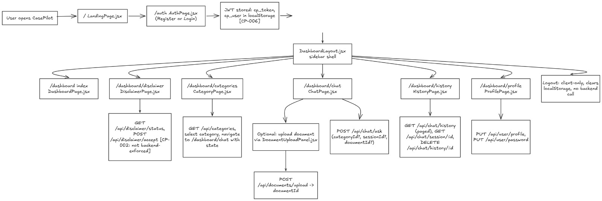
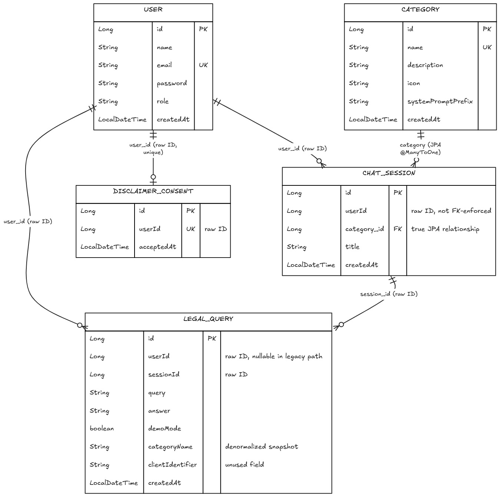
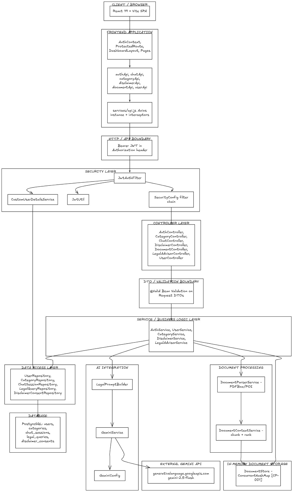

# CasePilot

CasePilot is an AI-assisted legal information application that helps users explore legal questions through category-aware conversations and document-supported queries.

## Overview

CasePilot provides a structured interface for users to describe legal concerns in natural language and receive simplified legal information. The application organizes conversations by legal category, maintains query history, and manages user-specific chat sessions.

The backend integrates the Gemini API to generate responses from legal prompts. Users can also upload PDF or Word documents, allowing CasePilot to extract relevant text and include selected document context when generating a response.

## Key Features

* JWT-based user registration, login, and protected application routes.
* Category-based legal query handling with category-specific prompt context.
* AI-assisted legal information generation through the Gemini API.
* Persistent chat sessions and paginated legal query history.
* PDF, DOC, and DOCX text extraction for document-assisted queries.
* In-memory document context retrieval using relevance-ranked text chunks.
* Legal disclaimer consent tracking for authenticated users.
* User profile updates and password management.

## Application Workflow

The following diagram summarizes the primary user flow from authentication to legal query processing.



1. The user registers or signs in and receives a JWT.
2. The authenticated user accepts the legal information disclaimer.
3. The user selects a legal category and starts a chat session.
4. An optional legal document can be uploaded and parsed for text context.
5. The backend builds a category-aware or document-grounded legal prompt.
6. Gemini generates the response, and the query is stored in PostgreSQL.
7. The user can continue the session or review previous query history.

## System Architecture



CasePilot uses a React frontend built with Vite and a Spring Boot REST API. Axios manages frontend API communication and attaches the stored JWT as a Bearer token to authenticated requests.

The backend is organized around controllers, services, Spring Data JPA repositories, and PostgreSQL persistence. Spring Security validates JWT authentication before protected endpoints are processed.

Legal queries are handled by the advisor service, which constructs contextual prompts and sends them to the Gemini API through a WebClient-based integration. Document uploads are parsed with Apache PDFBox or Apache POI, stored temporarily in memory, divided into text chunks, and ranked for relevant context before prompt generation.

## Database Design



PostgreSQL stores users, legal categories, chat sessions, legal queries, and disclaimer consent records. Chat sessions belong to individual users and can reference a legal category, while stored legal queries retain the session, user, category name, submitted question, generated answer, and response metadata.

## Tech Stack

| Layer                  | Technologies                                                            |
| ---------------------- | ----------------------------------------------------------------------- |
| Frontend               | React 19, Vite, React Router, Tailwind CSS, Axios                       |
| Backend                | Java 17, Spring Boot 3.2.3, Spring Web, Spring WebFlux, Spring Data JPA |
| Database               | PostgreSQL, Hibernate                                                   |
| AI / LLM               | Google Gemini API, Gemini 2.5 Flash                                     |
| Authentication         | Spring Security, JWT, JJWT                                              |
| Infrastructure / Tools | Maven, Lombok, Apache PDFBox, Apache POI                                |

## Project Structure

```text
CasePilot/
├── frontend/
│   └── src/
│       ├── components/
│       ├── context/
│       ├── layouts/
│       ├── pages/
│       └── services/
├── ai-legal-advisor-backend/
│   └── src/
│       ├── main/
│       │   ├── java/com/ailegal/advisor/
│       │   └── resources/
│       └── test/
├── docs/
└── README.md
```

The frontend and backend are maintained as separate application layers within the repository.

## Getting Started

### Prerequisites

* Java 17
* Maven
* Node.js and npm
* PostgreSQL

### Installation

Clone the repository:

```bash
git clone https://github.com/AryanSingh2006/CasePilot.git
cd CasePilot
```

Install frontend dependencies:

```bash
cd frontend
npm install
```

Install backend dependencies through Maven:

```bash
cd ../ai-legal-advisor-backend
mvn clean install
```

### Environment Configuration

The frontend supports the following environment variable:

```env
VITE_API_BASE_URL=http://localhost:8080
```

The backend reads the following environment variables:

```env
DB_USER=your_postgresql_username
DB_PASS=your_postgresql_password
GEMINI_API_KEY=your_gemini_api_key
JWT_SECRET=your_jwt_secret
```

The configured PostgreSQL database URL is:

```text
jdbc:postgresql://localhost:5432/casepilot
```

Create a PostgreSQL database named `casepilot` and configure `DB_USER` and `DB_PASS` for your local database credentials.

If `GEMINI_API_KEY` is not configured, the backend runs the legal response flow in its configured demo mode.

### Run the Application

Start the Spring Boot backend:

```bash
cd ai-legal-advisor-backend
mvn spring-boot:run
```

The backend runs on port `8080`.

Start the frontend in a separate terminal:

```bash
cd frontend
npm run dev
```

Vite starts the frontend development server and connects to the configured backend API.

## API Overview

| Area           | Endpoint                      | Purpose                                      |
| -------------- | ----------------------------- | -------------------------------------------- |
| Authentication | `POST /api/auth/register`     | Register a user                              |
| Authentication | `POST /api/auth/login`        | Authenticate and receive a JWT               |
| Categories     | `GET /api/categories`         | Retrieve available legal categories          |
| Chat           | `POST /api/chat/ask`          | Submit a legal query                         |
| Chat           | `GET /api/chat/history`       | Retrieve paginated query history             |
| Documents      | `POST /api/documents/upload`  | Parse and temporarily store a legal document |
| Disclaimer     | `POST /api/disclaimer/accept` | Record disclaimer consent                    |

## Disclaimer

CasePilot provides legal information for informational assistance only. It does not provide legal advice or replace consultation with a qualified legal professional.

## Author

**Aryan Singh**

[GitHub](https://github.com/AryanSingh2006)
[LinkedIn](https://www.linkedin.com/in/aryan-singh-70706635a/)
